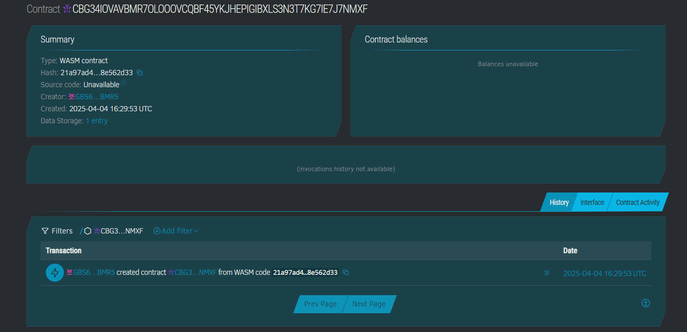

# IoT Data Marketplace

## Project Title
IoT Data Marketplace

## Project Description
A decentralized application (dApp) built on the Stellar blockchain for leasing physical or digital assets using Soroban smart contracts. The platform enables asset owners to lease out their items in exchange for Lumens (XLM), while smart contracts automatically handle lease terms, payments, and returns. This marketplace creates a trustless environment for IoT device owners to monetize their data and for consumers to access valuable data streams.

## contract address details:
R7OLOOOVCQBF45YKJHEPIGIBXLS3N3T7KG7IE7J7NMXF

## Project Vision
The IoT Data Marketplace aims to revolutionize how IoT devices and their data are monetized. By leveraging blockchain technology, we create a decentralized ecosystem where device owners can securely offer access to their devices or the data they produce. Our vision is to unlock the value of the billions of connected devices worldwide by creating a transparent, efficient marketplace that rewards data producers and empowers data consumers, all while maintaining data sovereignty, privacy, and security.

## Key Features

### Asset Registration and Management
- Register physical IoT devices or digital data streams as leasable assets
- Update asset descriptions, specifications, and availability
- Define pricing models (hourly, daily, weekly, monthly)
- Set quality of service guarantees and data specifications

### Smart Contract Lease Management
- Automated lease creation with custom terms and conditions
- Time-based access control for leased assets
- Secure payment escrow using XLM
- Automatic release of funds upon successful completion of lease terms

### Marketplace and Discovery
- Searchable directory of available IoT devices and data streams
- Filtering by device type, data type, location, or pricing
- Reputation system for both lessors and lessees
- Featured listings and promotional opportunities

### Payment Processing
- Automatic payment collection and distribution
- Microtransactions support for pay-per-use models
- Payment escrow for dispute resolution
- Multiple payment models (subscription, one-time, usage-based)

### Data Access Control
- Cryptographic access keys issued to lessees
- Automatic expiration of access based on lease terms
- Data privacy and sovereignty controls for asset owners
- Ability to revoke access for terms violations

### Dispute Resolution
- Built-in arbitration mechanisms
- Multi-signature release of escrowed funds
- Evidence submission for quality of service claims
- Community-based jury system for complex disputes

### Analytics and Reporting
- Usage statistics for asset owners
- Earnings reports and projections
- Market analytics for popular data types
- Performance metrics for IoT devices

### Security Features
- End-to-end encryption of sensitive data
- Decentralized identity verification
- Device authentication mechanisms
- Audit trails for all transactions and data access